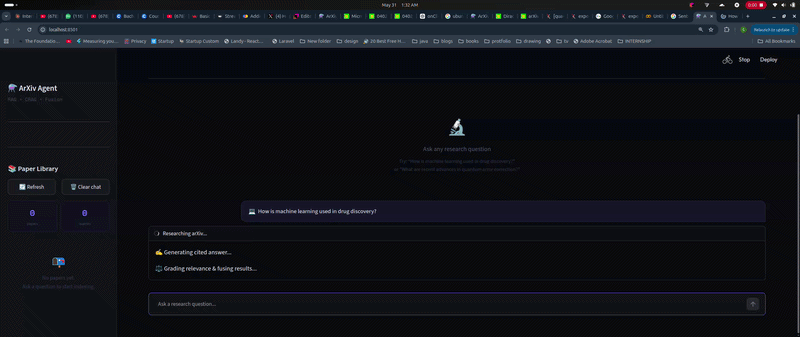

# ⚗️ ArXiv Research Agent
https://arxiv-research-agentt.streamlit.app/

A research assistant that answers questions using real academic papers from arXiv — not just what the LLM already knows.

Built with RAG Fusion, CRAG, multi-query translation, and multi-representation indexing.

---

## Demo
> *"How is machine learning used in drug discovery?"*



---

## How it works

```
Your question
     │
     ▼
Multi-query generation  ──  LLM rewrites into 5 different search queries
     │
     ▼
Research Paper Database API  ──  fetches up to 5 papers per query
     │
     ▼
Multi-representation indexing  ──  papers embedded as distilled summaries, stored as full text
     │
     ▼
CRAG grading  ──  each retrieved paper graded: relevant / partial / irrelevant
     │
     ▼
RAG Fusion (RRF)  ──  all result sets merged and re-ranked
     │
     ▼
Cited answer generation  ──  Llama 4 answers from top-ranked paper context
```

---

## Features

- **Multi-query translation** — question rewritten from multiple angles to improve recall
- **Multi-representation indexing** — embed distilled summaries, retrieve full text
- **CRAG** — irrelevant papers filtered, partial ones distilled before passing to LLM
- **RAG Fusion + RRF** — multiple result sets merged into one smart ranked list
- **Paper library** — sidebar shows every indexed paper with title, authors, categories
- **Cited answers** — every answer references actual paper titles
- **Live progress** — see each pipeline step as it runs

---

## Stack

| Component | Tool |
|---|---|
| LLM | Llama 4 Scout via Groq (free) |
| Embeddings | `sentence-transformers` (local, free) |
| Vector store | Numpy |
| Paper source | OpenAlex API |
| UI | Streamlit |

---

## Setup

**1. Clone the repo**
```bash
git clone https://github.com/samarthdubey46/arxiv-research-agent
cd arxiv-research-agent
```

**2. Install dependencies**
```bash
pip install streamlit sentence-transformers chromadb openai requests arxiv
```

**3. Get a free Groq API key**

Go to [console.groq.com](https://console.groq.com), sign up, create an API key.

**4. Run**
```bash
streamlit run app.py
```

Enter your Groq API key in the sidebar and start asking questions.

---

## Project structure

```
arxiv-research-agent/
├── app.py          # Streamlit UI
├── rag.py          # Full RAG pipeline
├── .streamlit/
│   └── config.toml # Dark theme config
└── README.md
```

---

## Built by

Samarth Dubey — BS-MS Physics, IISER Mohali  
[GitHub](https://github.com/samarthdubey46) · [LinkedIn](https://linkedin.com/in/samarthdubey46)
